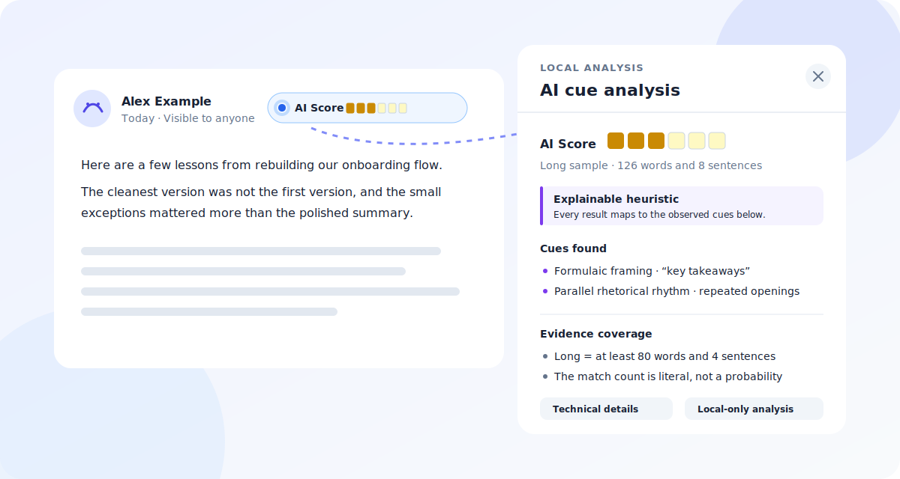

# AI-Style Signal Userscripts

[](https://github.com/christopherrbrown3/ai-detection-userscripts/actions/workflows/ci.yml)
[](LICENSE)

Privacy-first Safari userscripts that add an experimental AI-style signal to posts and comments on LinkedIn, X/Twitter, and Reddit.

> [!IMPORTANT]
> This project analyzes surface writing patterns. It cannot prove who or what wrote a post. Short, edited, personalized, multilingual, and mixed-authorship text may be impossible to classify reliably. Never use a badge as the basis for an accusation or high-stakes decision.



## Install

1. Install [Userscripts for Safari](https://github.com/quoid/userscripts).
2. Open one of the raw script links below in Safari.
3. Accept the Userscripts installation prompt and grant access only to that script's site.

| Site | Install | Coverage |
| --- | --- | --- |
| LinkedIn | [Install LinkedIn script](https://raw.githubusercontent.com/christopherrbrown3/ai-detection-userscripts/main/linkedin-ai-heuristic.userscripts.user.js) | Feed, profile activity, direct post permalinks, and comments |
| X/Twitter | [Install X script](https://raw.githubusercontent.com/christopherrbrown3/ai-detection-userscripts/main/x-ai-heuristic.userscripts.user.js) | Posts and replies |
| Reddit | [Install Reddit script](https://raw.githubusercontent.com/christopherrbrown3/ai-detection-userscripts/main/reddit-ai-heuristic.userscripts.user.js) | Current Reddit, old Reddit, posts, and comments |

Manual installation is also supported: open Userscripts → Manage → Open Scripts Folder, copy a root-level `.user.js` file there, enable it, and refresh the target site.

### Compatibility

The target is the current [Userscripts](https://github.com/quoid/userscripts) extension on Safari 16.4+ for macOS. The scripts include fallbacks for older emoji/CSS support, but older Safari releases and iOS layouts are best-effort rather than part of the automated fixture matrix. Current automated layouts cover LinkedIn feed posts/comments, profile activity, direct post permalinks, collapsed/expanded post text, X posts/replies, current Reddit posts/comments, and old Reddit posts/comments.

## What the badge means

The badge reports matches with a six-segment meter:

- **Green, no filled segments** — none of the six configured cue families matched.
- **Yellow, 1–3 filled segments** — one to three cue families matched.
- **Red, 4–6 filled segments** — four or more cue families matched.

The filled segment count is the literal match count; color is redundant status emphasis, not a separate calculation. Screen readers announce the exact count. Every non-empty matched post receives a cue assessment. The details panel separately reports **Short sample** (fewer than 20 words or 2 sentences), **Long sample** (at least 80 words and 4 sentences), or **Standard sample** (everything between those fixed cutoffs). The visible result is an explainable rubric, not a probability or claim that AI wrote the text.

Each rubric point maps to a visible cue family: explicit AI self-reference, formulaic framing, parallel rhetorical rhythm, highly structured presentation, unusually uniform sentence cadence, or repeated content phrasing. Weighted points remain visible as diagnostic intensity within a family, but they do not change the badge's exact family count.

Settings are stored locally for the current site and include:

- conservative, balanced, or aggressive thresholds when a calibrated model is installed
- comments/replies on or off
- hiding short or unsupported samples
- hiding posts with 0/6 cue families

## Privacy

All extraction and analysis happen inside the browser tab. The scripts:

- do not send post text, account data, browsing activity, scores, or feature vectors anywhere
- do not load a model, CDN asset, analytics SDK, or remote JavaScript dependency
- use site-local browser storage only for user settings

See [SECURITY.md](SECURITY.md) for the privacy boundary and reporting guidance.

## Detection approach

The shared detector core measures compact, explainable signals that can run locally:

- length-conditioned lexical diversity (MATTR-25)
- sentence, paragraph, and word-length variation
- character-, word-pair-, and three-word repetition
- sentence-opening reuse and short-sentence share
- function words, contractions, and first/second-person language
- punctuation, lists, formatting, and boundary-aware template phrases
- an optional 128-dimension hashed character 3–5-gram profile learned by the offline trainer
- local segment scoring for sufficiently long mixed-style text when a calibrated model is installed

Unicode is normalized and invisible formatting characters are removed before analysis. Unsupported or uncertain language evidence reduces or prevents a verdict rather than being treated as evidence of human authorship.

The root userscripts are generated from a shared detector and runtime plus thin platform adapters. That architecture prevents Python/JavaScript and cross-platform feature drift while keeping each installed script self-contained.

## Accuracy policy

The default installed behavior is an explicitly **heuristic cue rubric**, not a trained authorship classifier. It always returns an exact family count, shows every contributing cue, reports the fixed sample class separately, and makes no accuracy or probability claim. Human professional writing can contain these patterns, while generated or heavily edited text can avoid them.

The legacy experimental model output remains available only in Technical details for development comparison. A future trained model may replace the rubric only after a suitable distributable corpus and held-out report are published.

The offline pipeline enforces:

1. leakage-aware training, calibration, and test splits
2. held-out sigmoid calibration
3. a strong threshold derived only from held-out human scores at a requested false-positive target
4. separate reports by platform, content type, length, language, generator, attack, and authorship class
5. mixed-authorship evaluation without forcing mixed text into a binary training label

The full evaluation protocol and required robustness matrix are in [docs/benchmarking.md](docs/benchmarking.md).

## Development

Requirements: Python 3.10+ and Node.js 20+.

```bash
python3 -m pip install -r training/requirements.txt
npm install
npm run build
npm test
python3 -m unittest discover -s tests -p 'test_*.py' -v
```

Edit files under `src/` and `models/default-models.json`, then regenerate the root release files:

```bash
python3 scripts/build_userscripts.py
python3 scripts/build_userscripts.py --check
```

Tests cover feature parity between Python and JavaScript, scoring behavior, threshold selection, grouped splitting, nested DOM ownership, edited-content rescoring, and keyboard-accessible dialogs.

## Offline training

The pipeline accepts human, AI-generated, and mixed/hybrid JSONL records with optional platform, generator, language, attack, and source-group metadata. It can also normalize downloaded MultiSocial-style CSV, JSON, JSONL, or Parquet files.

See [training/README.md](training/README.md) for the schema, dataset preparation, adversarial augmentation, training, reporting, and safe model export workflow.

## Limitations

- Social posts are often shorter than reliable stylometry requires.
- A model trained on one platform or generator may fail on another.
- Paraphrasing, fine-tuning, personalization, human editing, and mixed authorship can reverse or erase useful signals.
- English-language learners, dialects, formulaic professional writing, and easy-to-read prose can be over-flagged by detectors.
- Site markup changes can temporarily break extraction; fixture tests cover known layouts but cannot guarantee future compatibility.

See [docs/troubleshooting.md](docs/troubleshooting.md) if badges are missing, duplicated, or misplaced.

## Research and license

[whitepapers/web_research.md](whitepapers/web_research.md) records the primary research behind the accuracy and UX decisions. Contributions should include evidence and an ablation or regression test for detection changes.

Released under the [MIT License](LICENSE).
