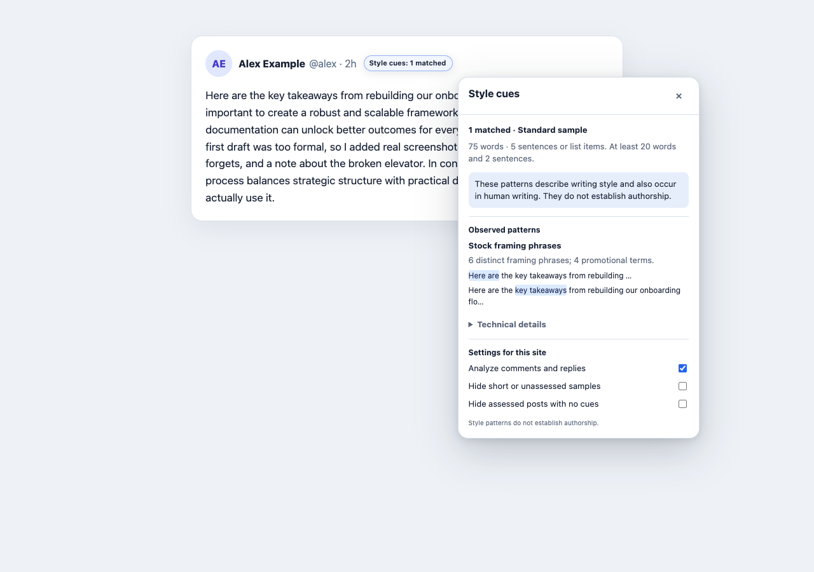

# AI-Style Signal Userscripts

[](https://github.com/christopherrbrown3/ai-detection-userscripts/actions/workflows/ci.yml)
[](LICENSE)

A privacy-first Safari userscript that shows observable writing-style cues on posts and comments on LinkedIn, X/Twitter, and Reddit, with experimental Facebook support.

> [!IMPORTANT]
> This project analyzes surface writing patterns. It cannot prove who or what wrote a post. Short, edited, personalized, multilingual, and mixed-authorship text may be impossible to classify reliably. Never use a badge as the basis for an accusation or high-stakes decision.



## Install

1. Install [Userscripts for Safari](https://github.com/quoid/userscripts).
2. Open **[Install AI-Style Cues — all supported sites](https://raw.githubusercontent.com/christopherrbrown3/ai-detection-userscripts/main/ai-style-cues.userscripts.user.js)** in Safari.
3. Accept the Userscripts installation prompt and grant access to the supported sites you want to use.
4. If upgrading from the three site scripts, disable those scripts and refresh your tabs. Follow the [migration and rollback guide](docs/migration.md) to keep your settings and backups.

One self-contained script supports LinkedIn, X/Twitter, and Reddit, plus opt-in Facebook desktop text analysis. Only the adapter for the current site runs. Instagram, Threads, Bluesky, and YouTube are not yet supported. See the generated [supported-site and route matrix](docs/supported-sites.md).

**Facebook starts disabled.** On `www.facebook.com`, open **Style cues off · Settings** and turn on **Enable style cues on this site**. Version 0.6 adds `www.facebook.com` and `facebook.com` to the combined script's permissions; Safari may require website access before the launcher appears. Facebook is experimental: live Safari checks cover feed, profile/Page, permalink/dialog, comments/replies, and preference persistence, alongside synthetic regressions. Some layouts will be skipped. See [Facebook scope and validation](docs/facebook-validation.md).

Optional targeted installations retain their existing names, update URLs, and narrower host permissions:

| Site | Optional install | Coverage |
| --- | --- | --- |
| LinkedIn | [LinkedIn script](https://raw.githubusercontent.com/christopherrbrown3/ai-detection-userscripts/main/linkedin-ai-heuristic.userscripts.user.js) | Feed, profile activity, direct post permalinks, and comments |
| X/Twitter | [X script](https://raw.githubusercontent.com/christopherrbrown3/ai-detection-userscripts/main/x-ai-heuristic.userscripts.user.js) | Posts and replies |
| Reddit | [Reddit script](https://raw.githubusercontent.com/christopherrbrown3/ai-detection-userscripts/main/reddit-ai-heuristic.userscripts.user.js) | Current Reddit, old Reddit, posts, and comments |
| Facebook | [Facebook script](https://raw.githubusercontent.com/christopherrbrown3/ai-detection-userscripts/main/facebook-ai-heuristic.userscripts.user.js) | Experimental desktop published-text markers and permalink-identified comments/replies; opt-in |

Manual installation: open Userscripts → Manage → Open Scripts Folder, copy the desired root-level `.user.js` file there, enable it, and refresh the target site. Keep only your intended installation enabled. Do not install the metadata-only `.meta.js` files.

### Compatibility

The target is the current [Userscripts](https://github.com/quoid/userscripts) extension on Safari 16.4+ for macOS. The scripts include fallbacks for older emoji/CSS support, but older Safari releases and iOS layouts are best-effort rather than part of the automated fixture matrix. Current automated layouts cover LinkedIn feed posts/comments, profile activity, direct post permalinks, collapsed/expanded post text, X posts/replies, current Reddit posts/comments, old Reddit posts/comments, and synthetic Facebook desktop posts/dialogs/comments/replies. Facebook mobile hosts, Groups routes, messaging, Stories, Reels, and Marketplace are excluded.

## What the badge means

The badge shows **AI Score: N/6 cues** and a six-bar meter. Each filled bar is one matched pattern family, regardless of how often it occurs. For example, two families give **2/6 cues** and two filled bars. **Authorship probability is unavailable**: these families are not equally predictive or statistically independent, and the project has no validated probability model for this display. Open the badge for descriptions and highlighted examples. The original post is never marked up or changed.

- **0/6 cues** means the rules ran and found no configured patterns. It does not establish human authorship. Generated text can also match none.
- **Short sample** appears directly on the badge for fewer than 20 words or 2 sentences/list items. Matches in these samples may be incidental.
- **Not assessed** appears with **Language uncertain** or **Unsupported language** when there is too little evidence to apply the English rules. This is different from zero matches.

Short, unassessed, and zero-match badges use neutral colors. Other matches use one accent color without a traffic-light severity scale. Unassessed text has no numeric count or meter, so it cannot be mistaken for a zero. Screen readers announce the exact count, unavailable probability, and sample status. The panel also reports word and sentence counts and classifies longer samples as standard or long (at least 80 words and 4 sentences/list items).

The six families are explicit model references, stock framing phrases, repeated sentence openings, list and punctuation structure, similar sentence lengths, and repeated phrases. Descriptions report observable patterns, not rhetorical intent or authorship. Lists are excluded from the three prose-based rhythm/repetition checks; counted openings are excluded from phrase repetition. These safeguards reduce overlapping matches without claiming that the families are statistically independent.

The **Style cue settings** button remains available even on empty pages or when every badge is hidden. Settings are stored locally for the current site/origin:

- enable or disable analysis on this site

- comments/replies on or off
- hiding short or unassessed samples
- hiding assessed posts with no cues

## Privacy

All extraction and analysis happen inside the browser tab. The scripts:

- do not send post text, account data, browsing activity, scores, or feature vectors anywhere
- do not load a model, CDN asset, analytics SDK, or remote JavaScript dependency
- store only user settings locally, separated by site/origin; Facebook uses userscript-manager storage so the page cannot erase its preferences

See [SECURITY.md](SECURITY.md) for the privacy boundary and reporting guidance.

## Detection approach

The browser preserves paragraph, line-break, and list boundaries while extracting the author's text. It excludes quotation blocks, quoted reposts where identified by the site adapter, code, and inline quotation/code spans. One deterministic sentence parser supplies both the cue checks and diagnostic metrics, including handling of common abbreviations, decimals, and URLs.

The default rules look for exact, inspectable patterns:

- explicit model-reference wording, excluding ordinary refusals such as “I cannot”
- combinations of stock framing phrases instead of a single everyday phrase
- repeated multiword sentence openings
- lists or punctuation clusters, with punctuation density adjusted for text length
- similar prose sentence lengths with minimum sample requirements
- contiguous repeated 3–5-word phrases, with overlapping spans counted once and repetition measured relative to prose length

Unicode is normalized and invisible formatting characters are removed before analysis. The language check uses script and English function-word evidence; it is a conservative eligibility heuristic, not a language classifier.

Posts approaching the viewport are queued in small batches. Edits re-extract the affected post, unchanged text reuses its analysis, and a bounded cache shares results for duplicate content. Legacy stylometry, character n-gram hashing, and model output are deferred until **Technical details** is opened in the default uncalibrated release.

The root userscripts are generated from one registry, shared detector/runtime/bootstrap, and thin platform adapters. Messaging routes are excluded and editable composers are omitted from text extraction. The offline Python extractor mirrors the shared sentence and exclusion rules for diagnostic feature parity.

## Accuracy policy

The default installed behavior is an explicitly **heuristic cue rubric**, not a trained authorship classifier. For eligible text it returns an exact family count and shows every contributing cue; otherwise it explicitly reports that the text was not assessed. It makes no accuracy or probability claim. Human professional writing can contain these patterns, while generated or heavily edited text can avoid them.

The legacy experimental model output remains available only in Technical details for development comparison. A future trained model may replace the rubric only after a suitable distributable corpus and held-out report are published.

Versions 0.5.1–0.6.0 converted the count to 0–100, making one family always appear as **17**. Version 0.6.1 removes that misleading precision without changing the detector. See the [research grounding and accuracy audit](docs/research-grounding.md) for the version history, known misses/false matches, exact research-to-code gaps, and the evaluation required before changing the model. The [badge validation report](docs/badge-validation.md) records overflow regression checks and live Safari verification.

The offline pipeline enforces:

1. leakage-aware training, calibration, and test splits
2. held-out sigmoid calibration
3. a strong threshold derived only from held-out human scores at a requested false-positive target
4. separate reports by platform, content type, length, language, generator, attack, and authorship class
5. mixed-authorship evaluation without forcing mixed text into a binary training label

The full evaluation protocol and required robustness matrix are in [docs/benchmarking.md](docs/benchmarking.md).

## Development

Requirements: Python 3.10+ and Node.js 20+.

```bash
python3 -m pip install -r training/requirements.txt
npm install
npm run build
npm test
python3 -m unittest discover -s tests -p 'test_*.py' -v
```

Edit files under `src/` and `models/default-models.json`, then regenerate the root release files:

```bash
python3 scripts/build_userscripts.py
python3 scripts/build_userscripts.py --check
```

Tests cover feature parity between Python and JavaScript, cue spans, quotation/code exclusion, list overlap, scoring behavior, threshold selection, grouped splitting, nested DOM ownership, edited-content rescoring, cache reuse, viewport scheduling, and keyboard-accessible dialogs. See [v0.5 consolidation validation](docs/consolidation-validation.md) for generated-bundle parity, isolated-world coexistence, workload measurements, and verification limits. The [v0.4 cue validation](docs/browser-validation.md) records the earlier rule changes and list ablation. Architecture, the adapter contract, and a contributor template are documented in [adding sites](docs/adding-sites.md).

## Offline training

The pipeline accepts human, AI-generated, and mixed/hybrid JSONL records with optional platform, generator, language, attack, and source-group metadata. It can also normalize downloaded MultiSocial-style CSV, JSON, JSONL, or Parquet files.

See [training/README.md](training/README.md) for the schema, dataset preparation, adversarial augmentation, training, reporting, and safe model export workflow.

## Limitations

- Social posts are often shorter than reliable stylometry requires.
- A model trained on one platform or generator may fail on another.
- Paraphrasing, fine-tuning, personalization, human editing, and mixed authorship can reverse or erase useful signals.
- English-language learners, dialects, formulaic professional writing, and easy-to-read prose can be over-flagged by detectors.
- Site markup changes can temporarily break extraction; fixture tests cover known layouts but cannot guarantee future compatibility.

See [docs/troubleshooting.md](docs/troubleshooting.md) if badges are missing, duplicated, or misplaced.

## Research and license

[whitepapers/web_research.md](whitepapers/web_research.md) records the primary research behind the accuracy and UX decisions. Contributions should include evidence and an ablation or regression test for detection changes.

Released under the [MIT License](LICENSE).
